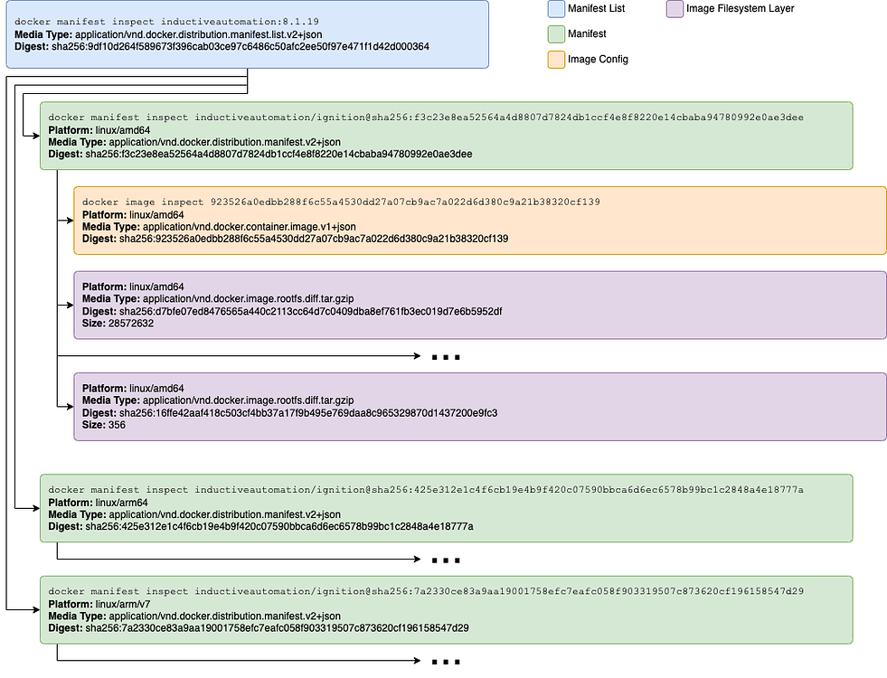
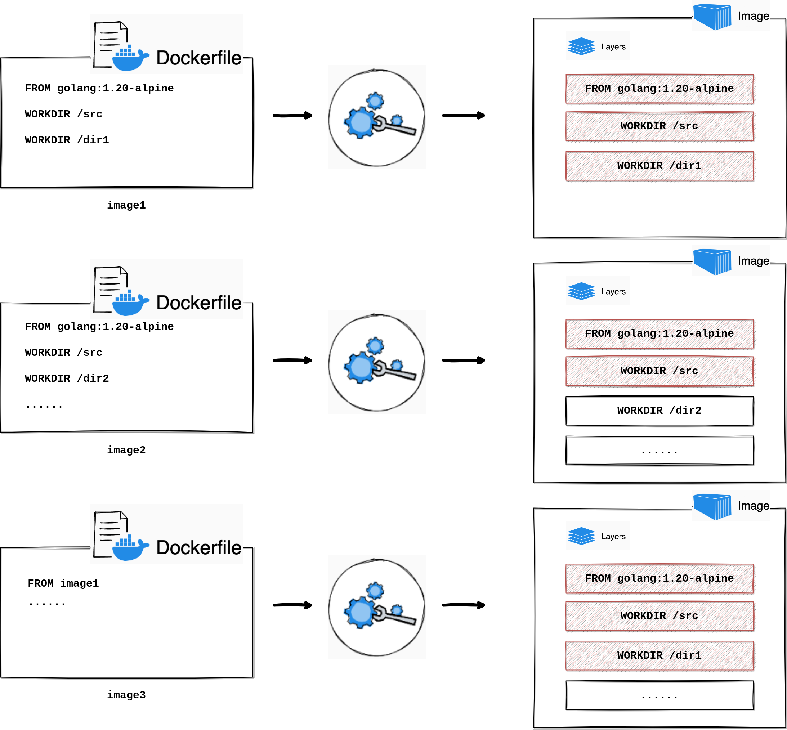
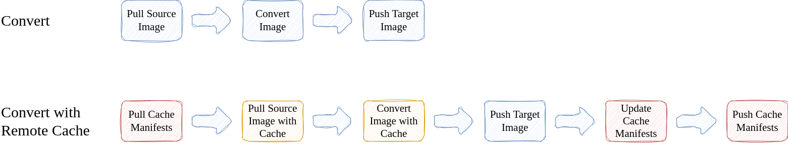
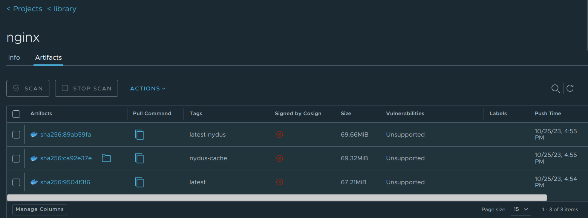
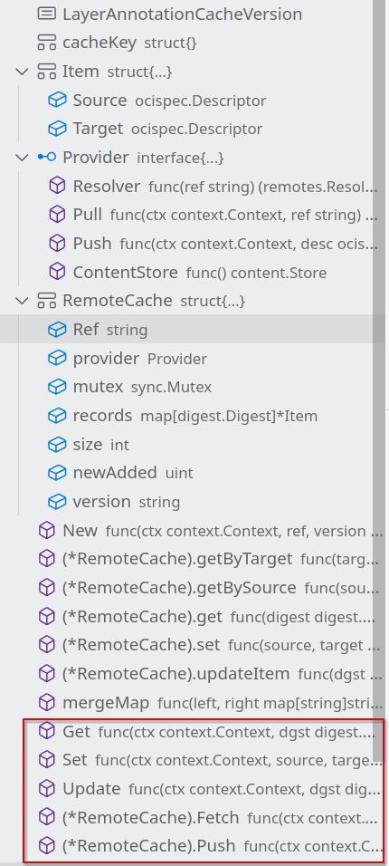
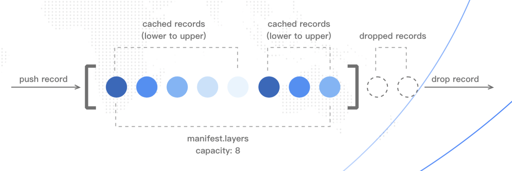

# Acceld 远端缓存实现
---


## 1. 关于 Nydus & Acceleration-service

### 1.1 Nydus
[Nydus 镜像加速框架](https://nydus.dev/)项目是 CNCF 开源项目 [Dragonfly](https://d7y.io/) 的子项目，它是对 OCI 镜像格式的探索改进，Nydus 提供了容器镜像与多种数据的按需加载的能力，它已在生产环境支撑了每日百万级别的容器创建，将容器或代码包的端到端冷启动时间从分钟级降低到了秒级。Nydus 目前由蚂蚁集团，阿里云，字节跳动联合研发，也是 [Kata Containers](https://katacontainers.io/) 与 Linux 内核态原生支持的镜像加速方案。

### 1.2 Acceleration-service

加速镜像格式和普通镜像格式不同，构建或转换步骤是必须的，可以使用 [Buildkit](https://github.com/moby/buildkit) 从 Dockerfile 直接构建加速镜像，也可以使用 [Nerdctl](https://github.com/containerd/nerdctl) 或 [Nydusify](https://github.com/dragonflyoss/nydus/blob/master/docs/nydusify.md)转换工具。为了让Harbor 进一步支持用户透明地使用加速镜像，[Harbor](https://goharbor.io/) 的子项目 [Acceleration-service](https://github.com/goharbor/acceleration-service) 诞生了，Acceleration-service 为 Harbor 提供了自动转换加速镜像的能力。

Acceld作为通用的加速镜像转换框架，提供了两种转换服务。

- Acceld 是一个通过 Harbor Webhook 扩展的服务，它是一个通用的加速镜像转换框架。当用户推送镜像时，Harbor 向该服务发送 Webhook 请求，通过其集成的 Nydus、eStargz 等转换驱动完成镜像的转换。

- AccelCtl 是一个CLI服务，指定源镜像后同样通过集成的转换驱动完成一次加速镜像转换。

[Nydusify](https://github.com/dragonflyoss/nydus/blob/master/docs/nydusify.md) 是 Nydus 生态提供的工具，可用于转换，挂载，校验 Nydus 镜像，其中 Convert 子命令可以将普通的 docker镜像或者OCI镜像转换为Nydus 镜像,并将其推送到远端仓库中，而Nydusify采用了Acceleration-service提供的镜像转换服务，通过集成的转换驱动来完成对应的Nydus镜像转换。

## 2. Issue描述

容器镜像是由manifest, config和若干layer组成，容器镜像示意：



- layer 文件一般是 tar 包或者压缩后的 tar 包，包含镜像数据文件，多个 layer 文件共同组成一个完整的根文件系统(也就是从该镜像启动容器后，进入容器中看到的文件系统)。
- config 文件是一个 JSON 文件，包含镜像的一些配置信息，比如镜像时间、修改记录、环境变量、镜像的启动命令等等。
- manifest 文件也是一个 JSON 文件，可以看作是镜像文件的清单，标识了镜像包含了哪些 layer 文件和哪个 config 文件。
- index 文件也是一个 可选的 JSON 文件，可以被认为是 manifest 的 manifest，用来索引多个不同架构平台的image镜像。

而不同的容器镜像之间可能有相同的镜像层，下图示意了通过dockerfile创建的过程，假如存在另一个镜像在构建的时候，以相同的 `FROM golang:1.20-alpine` 作为base layer, 或者是使用已有的base image,那么这两个镜像便包含相同的image layer.



当Acceld进行加速镜像转换时，事实上是需要通过containerd的Converter，通过指定的转换驱动,对源镜像的每一层layer、镜像的manifest和config进行转换，从而完成整个容器镜像的转换。

当前的问题是某些镜像可能存在相同的镜像层，对于已经转换过的镜像层，仍然会进行重复且不必要的镜像层转换，我需要为Acceleration-service提供转换缓存的功能并将缓存功能集成到Nydusify的Convert子命令中，使得对于某些已经转换后的镜像层不必再度转换。

在用户 Push 镜像后，Acceleration-service 创建加速镜像转换任务，它需要先拉取原始镜像数据，转换完成后将加速镜像 Push 回 Harbor，Acceleration-service 需要支持本地与远端两种缓存机制：
- 本地缓存：用于缓存源镜像层，避免相同镜像层的重复拉取；
- 远端缓存：用于缓存转换后的镜像层，避免相同镜像层的重复转换；


## 3. 我的工作

对于当前的镜像转换框架，我们将框架内的转换工作增添了拉取缓存、更新缓存、推送缓存的逻辑，并对原有的拉取源镜像、转换源镜像进行修改，使其可以跳过不必要的重复的镜像层，转换工作示意图如下：


### 3.1 远端缓存存储实现

首先我们使用了cache manifest来存储在某个platform下的已转换过的镜像layer数据，随后使用cache index来存储多个platform下的cache manifest，缓存会伴随相同镜像，并以指定的tag后缀存入Harbor同一repository下(若不指定tag,则表示禁用缓存)，下图为nginx镜像以及nginx缓存在Harbor中的存储形式。



​	`cache image index`，存储了不同platform的cache manifest，`cache image index` 示例如下

```json
{
  "schemaVersion": 2,
  "mediaType": "application/vnd.oci.image.index.v1+json",
  "manifests": [
    {
      "mediaType": "application/vnd.oci.image.manifest.v1+json",
      "digest": "sha256:4778928307d551db03197c8458c2d25f5c1fe4925e8a3da3f0516400cbf2234f",
      "size": 693,
      "platform": {
        "architecture": "arm64",
        "os": "linux",
        "os.features": [
          "nydus.remoteimage.v1"
        ],
        "variant": "v8"
      }
    },
    {
      "mediaType": "application/vnd.oci.image.manifest.v1+json",
      "digest": "sha256:e2924242732b3cf0fffa7c5af813f135d72fd2e3b05ab02b4e3f0190fbd6738e",
      "size": 693,
      "platform": {
        "architecture": "amd64",
        "os": "linux",
        "os.features": [
          "nydus.remoteimage.v1"
        ]
      }
    }
  ]
}
```
`cache manifest`中的`Layer`层记录了某个repository在某个platform下的缓存层，其中Layer的`Digest`记录了转换后的Layer的sha256摘要值，这也是一个镜像层的唯一标识，Layer的`Annotation`中记录了Layer的一些附属信息，其中`containerd.io/snapshot/nydus-source-digest`字段记录了该层未被转换前的源镜像层，`cache manifest` 示例如下：

```json
{
  "schemaVersion": 2,
  "mediaType": "application/vnd.oci.image.manifest.v1+json",
  "config": {
    "mediaType": "application/vnd.oci.image.config.v1+json",
    "digest": "sha256:44136fa355b3678a1146ad16f7e8649e94fb4fc21fe77e8310c060f61caaff8a",
    "size": 2
  },
  "layers": [
    {
      "mediaType": "application/vnd.oci.image.layer.nydus.blob.v1",
      "digest": "sha256:a4003a6f4a4dccb6e2d535d6d047b12fbb1e5a447fb7ac8994e2a8e027a5608d",
      "size": 4299951,
      "annotations": {
        "containerd.io/snapshot/nydus-blob": "true",
        "containerd.io/snapshot/nydus-source-digest": "sha256:af09961d4a43b504efc76e38b50918977c28be73eeb8b926247783a00e8b9f2f"
      }
    }
  ]
}
```

### 3.2 Fetch，Update，Push cache 

Remote Cache作为单独的module，Converter模块在转换过程前后可以使用以下接口来操作缓存：
- Get 根据源镜像层Digest获取转换后镜像层Digest 
- Set 向cache中增加某一条缓存记录信息
- Update 更新cache中的缓存记录信息
- Fetch 从远端拉取cache manifest并写入cache中
- Push 将本地的缓存记录推送到Harbor远端



​结合上面转换流程图，	**对于缓存的操作可以概括为， Fetch -> Convert -> Fetch -> Update -> Push**。

- Fetch(第一次) 拉取缓存，用于源镜像拉取与镜像转换服务
- Convert 通过wrap后的Info、Update等方法，在转换过程中使用缓存，避免无用的镜像层转换
- Fetch(第二次) 重新拉取缓存，避免本地转换时间久，远端缓存已被其他转换服务更新
- Update 根据重新拉取的缓存和在转换过程中新增加的缓存记录，通过LRU的淘汰策略，更新缓存记录，示意如下

- Push 将更新后的缓存推送到远端

### 3.3 Fetch Source Image and Convert with Cache

#### 3.3.1 避免相同镜像层拉取

在拉取源镜像之前，Converter会先尝试拉取同一repository下的缓存，若存在则从远端fetch config中指定的platform的cache manifest，并通过`Set`接口，将缓存记录存入本地，随后通过wrap后的`Info`和`Update`方法，得到源镜像层以及转换后Nydus的镜像层在本地已经存在的“假象”。

对源镜像层的拉取是分层进行，在拉取源镜像之前，containerd会先检查本地是否已经存在需要拉取的镜像层，若存在则不拉取，借由缓存提供源镜像层已经存在的“假象”，拉取缓存可以避免重复的拉取。

wrap后的`Info`方法和`Update`方法

```go
func (content *Content) Info(ctx context.Context, dgst digest.Digest) (ctrcontent.Info, error) {
	if _, cached := cache.Get(ctx, dgst); cached != nil {
		return ctrcontent.Info{
			Digest: cached.Digest,
			Size:   cached.Size,
			Labels: cached.Annotations,
		}, nil
	}

	return content.store.Info(ctx, dgst)
}

func (content *Content) Update(ctx context.Context, info ctrcontent.Info, fieldpaths ...string) (ctrcontent.Info, error) {
	// containerd content store write labels to annotate some blobs belong to a same repo,
	// cleaning gc related labels
	for k := range info.Labels {
		if strings.HasPrefix(k, "containerd.io/gc") {
			delete(info.Labels, k)
		}
	}

	updatedInfo, err := content.store.Update(ctx, info, fieldpaths...)
	if errors.Is(err, errdefs.ErrNotFound) {
		if _, cached := cache.Update(ctx, info.Digest, info.Labels); cached != nil {
			return ctrcontent.Info{
				Digest: cached.Digest,
				Size:   cached.Size,
				Labels: cached.Annotations,
			}, nil
		}
	}
	return updatedInfo, err
}
```

#### 3.3.2 避免相同镜像层重复转换

​	在 [nydus snapshotter](https://github.com/containerd/nydus-snapshotter) 转换过程中, 我们可以通过wrap后的 `Info` 方法来检查某个layer是否已经被转换过了，具体方法则是通过`Info`方法获取某个源镜像层的信息，随后检查镜像层的`label`，如果存在`containerd.io/snapshot/nydus-source-digest`这样的label,表示该镜像层存在转换后的Nydus镜像层缓存，不必重新进行转换，随后直接通过`Info`方法得到的镜像层信息，返回转换后的descriptor，达到镜像已经完成转换的"假象"，避免重复转换。

#### 3.3.3 转换性能数据

下表是wordpress镜像前后两次转换的性能数据，第二次是基于wordpress镜像添加增量层(几MB数据)构建的新镜像，没有本地缓存，只命中远端缓存的情况：

|image|cached layers/layers|pull|convert|push|
|---|---|---|---|---|
|wordpress|0/19|17.73s|23.53s|21.16s|
|wordpress+增量层|19/21|688ms|2.82s|962ms|

### 3.4 检查filesystem相同

​Nydus提供了两种不同的rafs version(v5和v6), 若是在转换过程中检查到了不同的fs version, 则会触发merge boostrap失败，此时我们需要以不使用缓存进行Nydus加速图像转换, **对此我们在设定了错误类型与返回码, 并在`check_compatibility`函数检查是否fs version是否相同, Acceld服务检查返回码来确定是否需要再次进行不使用缓存的转换**。

### 3.5 更多参考

PR比较多也比较零散，主要PR分布在以下：

https://github.com/goharbor/acceleration-service/pulls/PerseidMeteor

https://github.com/containerd/nydus-snapshotter/pulls/PerseidMeteor

https://github.com/dragonflyoss/nydus/pulls/PerseidMeteor