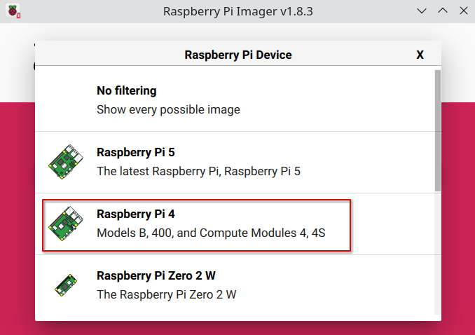

# Install docker on Raspberry Pi
---

{: .box-note}
**Note:** 因为是第一次碰树莓派的板子，需要在树莓派上装ubuntu 20.04，因此记录一下过程.

## 1. Raspberry Pi install Ubuntu20.04

环境是arch linux,直接pacman安装rpi-imager,用于烧录ubuntu20.04镜像.


打开rpi-imager.


选择device为树莓派4.



选择Other-general-purpose OS,选择Ubuntu,再选择ubuntu20.04 server 镜像，32位, 第一次的话会从网络上下载镜像.


将SD卡插入读卡器，然后选择Storage, 选择好SD卡，然后选择NEXT.


修改个人配置，然后一路选择Yes即可.


开始烧录.


## 2. SSH Raspberry Pi

{: .box-warning}
**Warning:** 因为手头没有显示器和键鼠，因此需要ssh到树莓派.

做法：

烧录好了之后会存在两个分区，在boot分区新建一个wap_supplicant.conf与ssh的空文件即可.


system-boot就是boot分区，启动操作系统和板子的时候需要这里面的东西,内容如下，里面已经新建了wap_supplicant.conf与ssh的空文件.


wap_supplicant.conf，ssid是wifi名字，psk是密码

```
ctrl_interface=DIR=/var/run/wpa_supplicant GROUP=netdev
country=CN
update_config=1

network={
  ssid="LLLL"
  psk="12345678"
}
```

writable分区其实就是ubuntu的根文件系统，大概长这样.


然后启动便可以ssh到树莓派了，后面根据需要自己修改。

