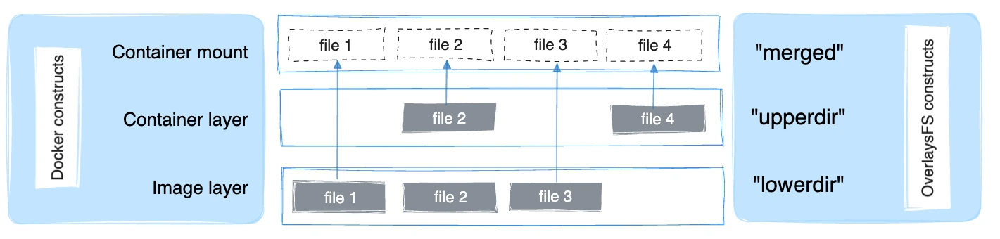
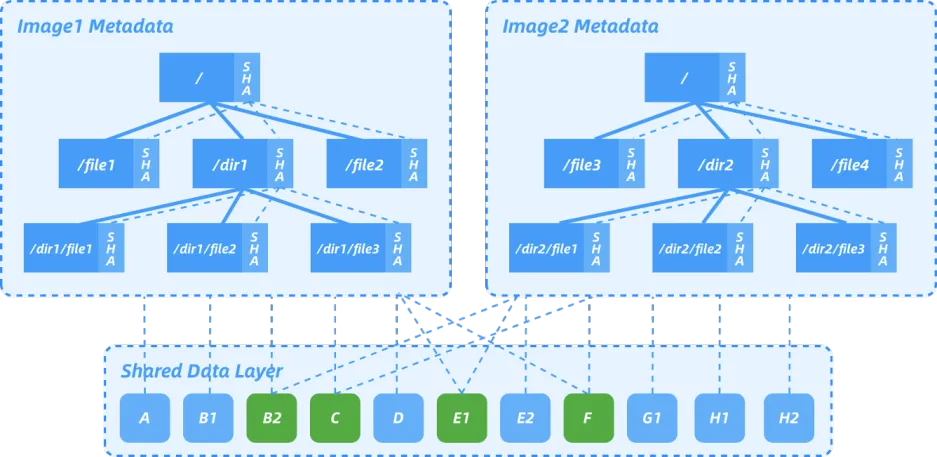

# Nydus加速镜像commit能力实现
---


## 1. 关于 Nydus

### 1.1 Nydus
[Nydus 镜像加速框架](https://nydus.dev/)项目是 CNCF 开源项目 [Dragonfly](https://d7y.io/) 的子项目，它是对 OCI 镜像格式的探索改进，Nydus 提供了容器镜像与多种数据的按需加载的能力，它已在生产环境支撑了每日百万级别的容器创建，将容器或代码包的端到端冷启动时间从分钟级降低到了秒级。Nydus 目前由蚂蚁集团，阿里云，字节跳动联合研发，也是 [Kata Containers](https://katacontainers.io/) 与 Linux 内核态原生支持的镜像加速方案。

### 1.2 overlay filesystem
[Overlay文件系统](https://docs.kernel.org/filesystems/overlayfs.html)是一种联合文件系统，它通过将多个文件系统叠加在一起来创建一个单一的虚拟文件系统。它通常由多个层（Layers）组成，其中底层是只读的基础镜像，而上层则是可写的容器层。当容器启动时，Overlay文件系统会将这些层按照一定的顺序叠加起来，形成一个容器的文件系统视图。这种层叠加的方式使得容器可以共享基础镜像，并且可以在容器启动后进行修改而不影响基础镜像或其他容器。


### 1.3 nerdctl commit
在用户在容器中进行开发或者测试时，可能在Nydus镜像容器中进行了环境部署、配置以及一部分的修改等，希望保存修改，可以直接在原有Nydus镜像基础上重新构建一个镜像，而不需要再修改 dockerfile 后再构建Nydus镜像。

特别的，在保存镜像的过程中，容器内的进程可能会在运行，为了保证镜像的一致性，因此容器的执行状态需要被冻结（freezer），以确保容器在镜像创建的过程中不会改变其状态。使用 cgroup freezer 可以有效地暂停容器内的所有进程，以便在保存镜像时保持容器状态的一致性。

nerdctl commit 的流程如下图所示，具体而言， commit 的流程为冻结容器内程序、查找容器的读写层目录、计算读写层差异并形成tar流、将tar流转换为tar.gz并形成新镜像、解冻容器内程序。


cgroup freezer: https://www.kernel.org/doc/Documentation/cgroup-v1/freezer-subsystem.txt
nerdctl commit: https://github.com/containerd/nerdctl/blob/main/pkg/imgutil/commit/commit.go#L67


## 2. 问题描述


目前对于运行 Nydus 镜像的容器，暂时没有类似 docker commit 或者 nerdctl commit 的能力将容器保存为新的 Nydus 镜像，因此需要提供类似的能力以满足用户需求，除此之外， nerdctl 目前的 commit 能力也存在以下不足：
- 不能commit 在容器内 mount 的目录；
- 不能过滤无需 commit 的目录；

因此，需要针对 Nydus 镜像容器进行特定的 commit 实现与优化，支持直接 commit 运行 nydus 镜像的容器，并过滤或者打包容器内指定的 mount 目录。


## 3. 相关工作


### 3.1 获取容器的mount信息

容器镜像提供了容器文件系统的初始状态，定义了容器运行时所需的文件和配置，而容器的 Overlay 目录则是容器在运行时使用的实际文件系统，它基于容器镜像构建而来，并在容器启动时被挂载到容器的命名空间中。而在运行容器的时候，容器所做的所有修改仅在 overlay 目录的读写层与 mount 目录，nydus commit 的核心工作便是将运行 Nydus 镜像容器的 upper 目录与指定的容器内 mount 目录，打包成为新的镜像层。

因此提供 Nydus 容器的 commit 能力首先要获取容器的 pid 、镜像名称、mount 目录等信息。通过容器内进程的pid，可进入容器的 mount namespace，以访问到容器内进程自己 mount 的目录；镜像名称用于 commit 后的镜像命名； mount目录信息则是用于获取 overlay 文件系统的读写层目录。具体的，对于 containerd，可以通过 containerd 的 Snapshot Service 服务，从容器的 mount 目录中，获取容器的 upper，lower 等目录；通过 Task、Image 接口等，获取容器内进程的 pid、镜像名称等信息。

具体做法如下

```go
func (m *Manager) Inspect(ctx context.Context, containerID string) (*InspectResult, error) {
	ctx = namespaces.WithNamespace(ctx, "default")
	client, err := containerd.New(m.address)
	if err != nil {
		return nil, errors.Wrapf(err, "create client")
	}
	container, err := client.LoadContainer(ctx, containerID)
	if err != nil {
		return nil, errors.Wrapf(err, "load container")
	}
	_image, err := container.Image(ctx)
	if err != nil {
		return nil, errors.Wrapf(err, "obtain container image")
	}
	image := _image.Name()

	task, err := container.Task(ctx, nil)
	if err != nil {
		return nil, errors.Wrapf(err, "obtain container task")
	}
	pid := int(task.Pid())

	containerInfo, err := container.Info(ctx, containerd.WithoutRefreshedMetadata)
	if err != nil {
		return nil, errors.Wrapf(err, "obtain container info")
	}
	spec := oci.Spec{}
	if err := json.Unmarshal(containerInfo.Spec.GetValue(), &spec); err != nil {
		return nil, errors.Wrapf(err, "unmarshal json")
	}
	mounts := []Mount{}
	for _, mount := range spec.Mounts {
		mounts = append(mounts, Mount{
			Destination: mount.Destination,
			Source:      mount.Source,
		})
	}

	snapshot := client.SnapshotService("nydus")
	lowerDirs := ""
	upperDir := ""
	mount, err := snapshot.Mounts(ctx, containerInfo.SnapshotKey)
	if err != nil {
		return nil, errors.Wrapf(err, "get snapshot mount")
	}
	// snapshot Mount Options[0] "workdir=$workdir", Options[1] "upperdir=$upperdir", Options[2] "lowerdir=$lowerdir".
	lowerDirs = strings.TrimPrefix(mount[0].Options[2], "lowerdir=")
	upperDir = strings.TrimPrefix(mount[0].Options[1], "uppe	rdir=")

	return &InspectResult{
		LowerDirs: lowerDirs,
		UpperDir:  upperDir,
		Image:     image,
		Mounts:    mounts,
		Pid:       pid,
	}, nil
}
```
### 3.2 准备镜像bootstrap
相比于传统容器而言，使用Nydus镜像的容器不会全额下载容器镜像，而是通过按需加载的方式，通过仅下载容器运行所需的镜像数据，从而实现镜像的快速启动，具体而言，如下图所示， Nydus 所采用的 Rafs的文件系统，包含一个独立的元数据 blob 和多个经过重复数据删除的内容可寻址数据 blob。在典型的 rafs 文件系统中，元数据存储在 bootstrap 中，而数据存储在 blobfile 中。 Nydus 将容器镜像分为元数据和数据两部分，其中元数据包含容器启动所需的所有内容，而数据则存储在块中，块大小为 1MB。目前，Rafs 有两个版本，分别是 Rafs v5（基于 FUSE 的文件系统）和 Rafs v6（与内核内 EROFS 文件系统兼容）。


如序号1所示，为 commit 新的 Nydus 镜像，则需要将源 Nydus 每一镜像数据层的 bootstrap 重新拉取，并与新的 Nydus 镜像层一起融合成为镜像新的bootstrap层。这首先则是需要通过已获取的镜像名，重新拉取源镜像每一镜像层的 bootstrap 数据。
当拉取源镜像的 bootstrap 数据时，同时根据镜像的 bootstrap layer 的 Annotations 信息，获取源镜像已 commit 的镜像层数，并与commit命令所指定的commit镜像的次数上限进行对比，判断镜像能否再次commit。

### 3.4 打包容器upper与挂载目录

如序号2、3所示，获取源镜像已有的 bootstrap 后，需要获取镜像的 bootstrap 信息，包括镜像的压缩算法、镜像的文件系统（rafs）版本，用于后续镜像数据层的打包。`nydus-image check`子命令提供了这样的能力，通过`nydus-image check -B <bootstrap_path> -J <output_json_path>`输出源 Nydus 镜像 bootstrap 信息并解析输出 json 可以获得所需信息。

在打包容器的 upper 目录时，引入了 buildkit 的 Diff 能力，即在排除用户不需要的目录后，计算容器 upper 读写层相比于 lower 只读层的修改，并写入 tar 流中，进行读写层的打包，值得注意的是 commit 镜像读写层的时候需要将容器内的进程暂停，并在打包完成之后再恢复运行。

容器内除了 upper 目录需要打包之外，用户还可能将其他目录挂载至容器，因此 Nydusify 提供了with-path选项，用于 commit 容器的挂载目录，并将其作为新的一层或者多层 Nydus 镜像层。然而对于挂载至容器的目录，从容器外是难以进行观测的，因此需要进入容器中，在容器中将容器挂载的目录一同制作成为新的Nydus镜像数据层。具体而言，则是通过在容器内运行 tar 命令，将容器挂载的目录通过 tar 流复制至容器外并打包成为新的 Nydus 镜像层。

具体做法如下：

```go
func (cm *Committer) commitUpperByDiff(ctx context.Context, appendMount func(path string), withPaths []string, withoutPaths []string, lowerDirs, upperDir, blobName, fsversion, compressor string) (*digest.Digest, error) {
	logrus.Infof("committing upper")
	start := time.Now()

	blobPath := filepath.Join(cm.workDir, blobName)
	blob, err := os.Create(blobPath)
	if err != nil {
		return nil, errors.Wrap(err, "create upper blob file")
	}
	defer blob.Close()

	digester := digest.SHA256.Digester()
	counter := Counter{}
	tarWc, err := converter.Pack(ctx, io.MultiWriter(blob, digester.Hash(), &counter), converter.PackOption{
		WorkDir:     cm.workDir,
		FsVersion:   fsversion,
		Compressor:  compressor,
		BuilderPath: cm.builder,
	})
	if err != nil {
		return nil, errors.Wrap(err, "initialize pack to blob")
	}

	if err := diff.Diff(ctx, appendMount, withPaths, withoutPaths, tarWc, lowerDirs, upperDir); err != nil {
		return nil, errors.Wrap(err, "make diff")
	}

	if err := tarWc.Close(); err != nil {
		return nil, errors.Wrap(err, "pack to blob")
	}

	blobDigest := digester.Digest()
	logrus.Infof("committed upper, size: %s, elapsed: %s", humanize.Bytes(uint64(counter.Size())), time.Since(start))

	return &blobDigest, nil
}
```
容器内除了upper目录需要打包之外，用户还可能将其他目录挂载至容器，因此Nydusify提供了`with-path`选项，用于commit容器的挂载目录，并将其作为新的一层或者多层Nydus镜像层。然而对于挂载至容器的目录，从容器外是难以进行观测的，因此需要进入容器中，在容器中将容器挂载的目录制作成为新的Nydus镜像数据层。

具体的，则是通过在容器内运行tar命令，将容器挂载的目录通过tar流复制至容器外并打包成为新的Nydus镜像层

```go
func copyFromContainer(ctx context.Context, containerPid int, source string, target io.Writer) error {
	config := &Config{
		Mount:  true,
		Target: containerPid,
	}

	stderr, err := config.ExecuteContext(ctx, target, "tar", "--xattrs", "--ignore-failed-read", "--absolute-names", "-cf", "-", source)
	if err != nil {
		return errors.Wrap(err, fmt.Sprintf("execute tar: %s", strings.TrimSpace(stderr)))
	}
	if stderr != "" {
		logrus.Warnf("from container: %s", stderr)
	}

	return nil
}

// ExecuteContext the given program using the given nsenter configuration and given context
// and return stdout/stderr or an error if command has failed
func (c *Config) ExecuteContext(ctx context.Context, writer io.Writer, program string, args ...string) (string, error) {
	cmd, err := c.buildCommand(ctx)
	if err != nil {
		return "", fmt.Errorf("Error while building command: %v", err)
	}

	// Prepare command
	var srderr bytes.Buffer
	rc, err := cmd.StdoutPipe()
	if err != nil {
		return "", fmt.Errorf("Open stdout pipe: %v", err)
	}
	defer rc.Close()

	cmd.Stderr = &srderr
	cmd.Args = append(cmd.Args, program)
	cmd.Args = append(cmd.Args, args...)

	if err := cmd.Start(); err != nil {
		return srderr.String(), err
	}

	// HACK: we can't wait rc.Close happen automatically when process
	// exits, so must check process state and call rc.Close() by manually.
	go func() {
		for {
			time.Sleep(time.Second * 1)
			if cmd.ProcessState != nil && cmd.ProcessState.Exited() {
				rc.Close()
				break
			}
		}
	}()

	if _, err := io.Copy(writer, rc); err != nil {
		return srderr.String(), err
	}

	return srderr.String(), cmd.Wait()
}
```
在打包完成新commit的Nydus镜像层后，则将新镜像层推送至远端仓库。
### 3.5 融合bootstrap完成镜像commit

如序号4、5所示，最后在容器读写层打包结束后，将源镜像中的各镜像层的 bootstrap 数据与新构建出的 bootstrap 数据重新 merge成为新的镜像 bootstrap 层，并生成或修改新 Nydus 镜像的 manifest 与 config 信息，将新生成的镜像层推送至远端镜像仓库，至此Nydus镜像 commit 完成。

### 3.5 更多参考
[1] Nydus加速框架 https://www.cncf.io/

[2] Nydus —— 下一代容器镜像的探索实践 https://developer.aliyun.com/article/971522

[3] Nydus | 容器镜像基础 https://developer.aliyun.com/article/1071132?spm=5176.26934562.main.3.1c5b43c9uZVdTg#slide-0

[4] Buildkit https://github.com/moby/buildkit/blob/master/docs/nydus.md

[5] Nerdctl https://github.com/containerd/nerdctl

[6] Nydusify https://github.com/dragonflyoss/nydus/blob/master/docs/nydusify.md

[7] Nydus design https://github.com/dragonflyoss/nydus/blob/master/docs/nydus-design.md


